# Design Language

Visual reference for poe-code CLI design elements.

This document is auto-generated. Run `npm run generate:design-docs` to regenerate.

## Package Overview

The `@poe-code/design-system` package provides consistent visual styling for the poe-code CLI.

```typescript
// Import components
import { text, symbols, intro, outro, log } from "@poe-code/design-system";

// Import tokens for advanced customization
import { brand, dark, light, spacing, typography, widths } from "@poe-code/design-system";
```

## Design Tokens

Foundational values that ensure consistency:

| Token | Value | Description |
|-------|-------|-------------|
| `brand` | `#a200ff` | Primary brand color (Poe purple) |
| `spacing.sm` | `1` | Small spacing unit |
| `spacing.md` | `2` | Medium spacing unit |
| `spacing.lg` | `4` | Large spacing unit |
| `widths.header` | `60` | Header line width |
| `widths.helpColumn` | `24` | Help text column width |
| `widths.maxLine` | `80` | Maximum line width |

## Theme Palettes

The design system supports dark and light themes, auto-detected from environment:

```typescript
import { getTheme, resolveThemeName } from "@poe-code/design-system";

const themeName = resolveThemeName(); // 'dark' or 'light'
const palette = getTheme();
console.log(palette.header('Title'));
```

**Environment variables checked (in order):**
- `POE_CODE_THEME` - explicit override ('dark' or 'light')
- `APPLE_INTERFACE_STYLE` - macOS appearance
- `VSCODE_COLOR_THEME_KIND` - VS Code theme
- `COLORFGBG` - terminal color hint

## Layout Patterns

Standard command layout patterns. These show complete UI flows from start to finish.

### layout-basic

Core layout: intro banner, info messages, resolved prompts, success message

```typescript
import { intro, outro, log, symbols } from "@poe-code/design-system";

intro("Configure");
log.message("Configuring...", { symbol: symbols.info });
log.message("Provider\n   claude", { symbol: symbols.resolved });
log.message("API Key\n   poe-abc...xyz", { symbol: symbols.resolved });
outro("Configuration complete.");
```

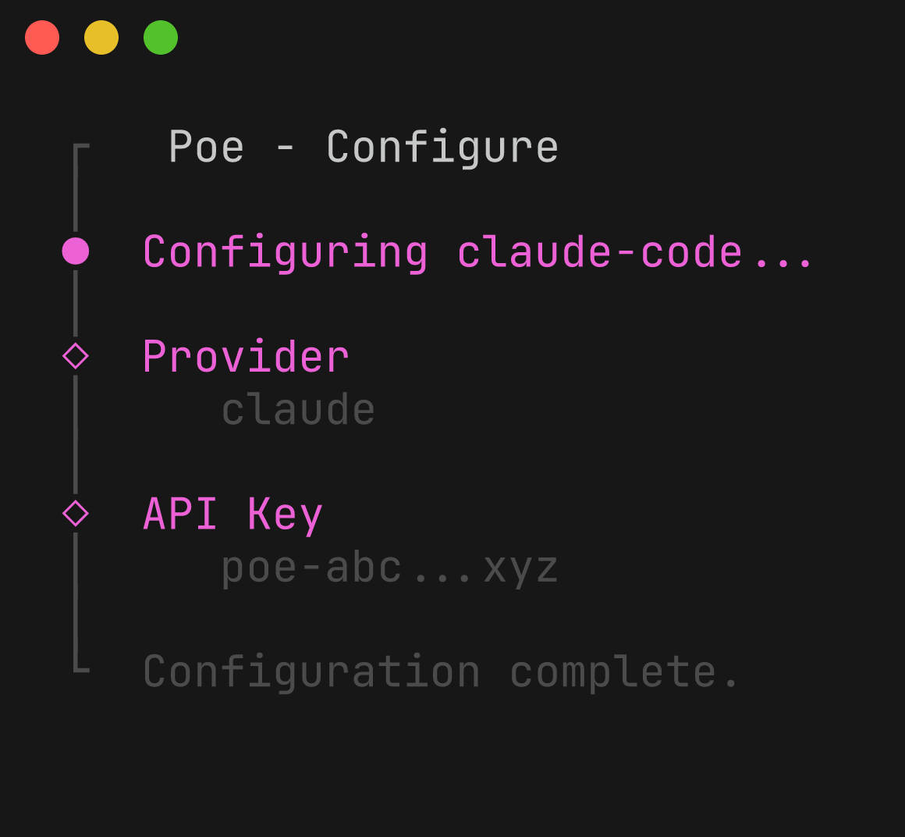

### layout-expanded

Full layout with note and outro: intro, resolved prompts, success, note box, outro

```typescript
import { intro, outro, note, log, symbols } from "@poe-code/design-system";

intro("configure claude-code");
log.message("Claude Code default model\n   Claude-Opus-4.6", { symbol: symbols.resolved });
log.message("Configured Claude Code.", { symbol: symbols.success });
note("If using VSCode...\nvscode://settings/...", "Next steps.");
outro("Problems? https://...");
```

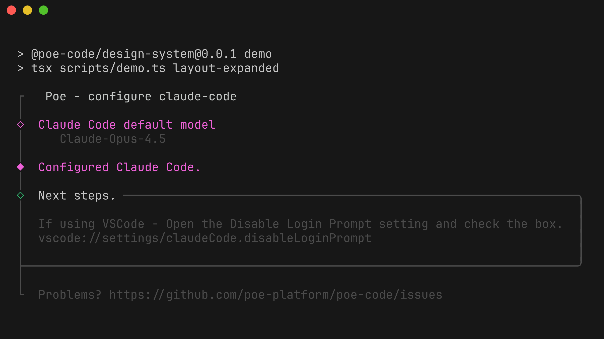

## Text Styles

Semantic text styling functions for consistent CLI output. Import from `@poe-code/design-system`.

### intro

Prominent introductory banners with brand background

```typescript
import { text } from "@poe-code/design-system";
text.intro("Configure")
```


### heading

Section headings with brand accent color

```typescript
import { text } from "@poe-code/design-system";
text.heading("Available Commands")
```

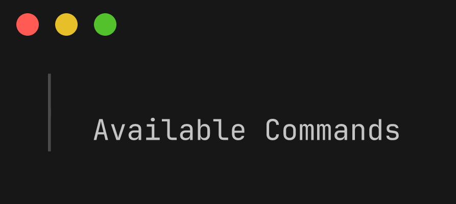

### section

Bold text for subsection labels

```typescript
import { text } from "@poe-code/design-system";
text.section("Options:")
```

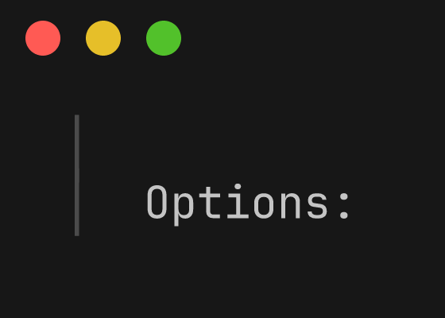

### command

CLI command names in accent color

```typescript
import { text } from "@poe-code/design-system";
text.command("poe-code configure")
```

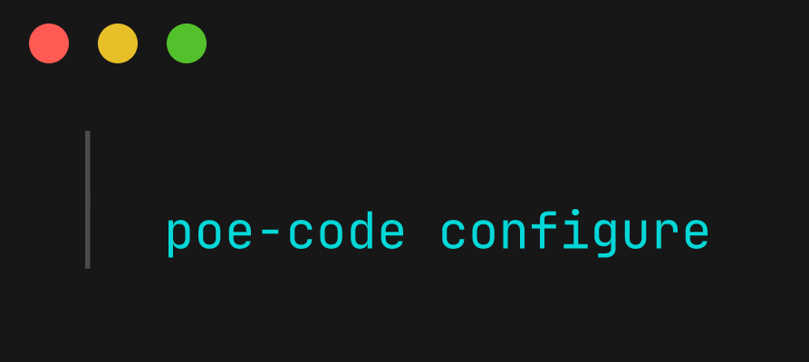

### argument

Command arguments (dimmed)

```typescript
import { text } from "@poe-code/design-system";
text.argument("<provider>")
```

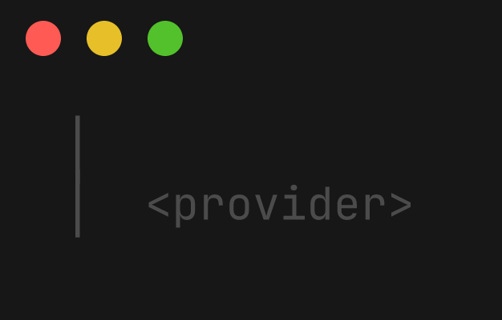

### option

CLI flags and options in yellow

```typescript
import { text } from "@poe-code/design-system";
text.option("--dry-run")
```

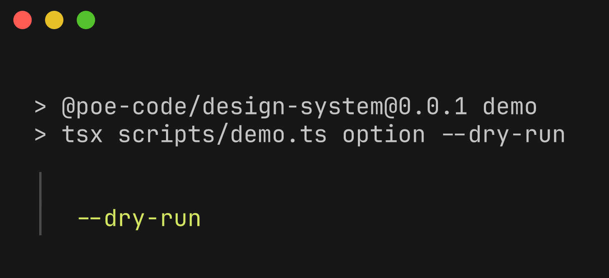

### example

Example text (dimmed)

```typescript
import { text } from "@poe-code/design-system";
text.example("$ poe-code configure claude")
```

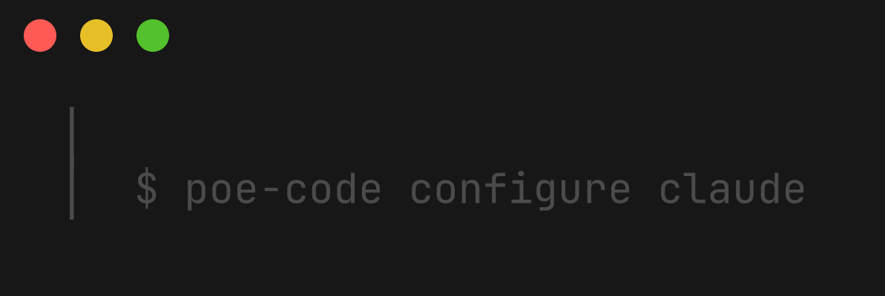

### usageCommand

Commands in usage examples (green)

```typescript
import { text } from "@poe-code/design-system";
text.usageCommand("npm install -g poe-code")
```

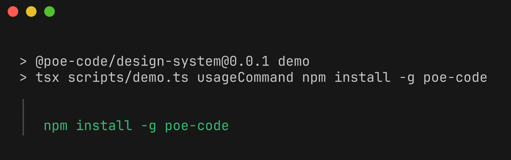

### link

Hyperlinks and references

```typescript
import { text } from "@poe-code/design-system";
text.link("https://poe.com")
```

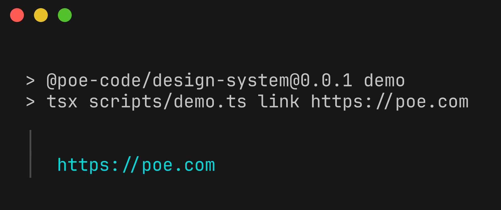

### muted

De-emphasized text

```typescript
import { text } from "@poe-code/design-system";
text.muted("(optional)")
```

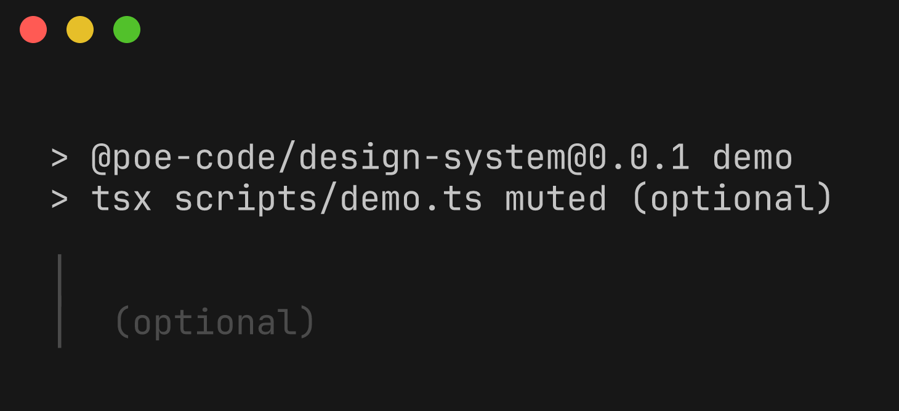

## Symbols

Status indicators and visual markers. Use with `log.message()` for structured output.

### info

Information indicator (magenta dot)

```typescript
import { log, symbols } from "@poe-code/design-system";
log.message("Configuring claude-code...", { symbol: symbols.info });
```

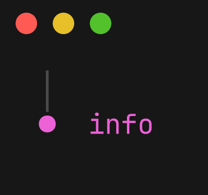

### success

Success indicator (magenta diamond)

```typescript
import { log, symbols } from "@poe-code/design-system";
log.message("Configuration complete!", { symbol: symbols.success });
```

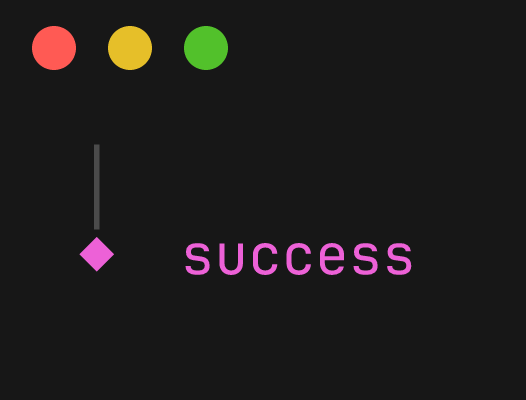

### resolved

Resolved/completed indicator (hollow diamond)

```typescript
import { log, symbols } from "@poe-code/design-system";
log.message("API Key\n   poe-abc...xyz", { symbol: symbols.resolved });
```

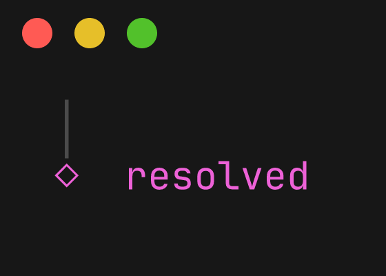

### errorResolved

Error with details indicator (red square)

```typescript
import { log, symbols } from "@poe-code/design-system";
log.message("Config Failed\n   Missing API key", { symbol: symbols.errorResolved });
```


## Log Messages

Structured logging with appropriate visual weight. Import `log` from the prompts module.

### log-info

Informational messages during operations

```typescript
import { log, symbols } from "@poe-code/design-system";
log.message("Configuring claude-code...", { symbol: symbols.info });
```


### log-success

Success confirmation messages

```typescript
import { log, symbols } from "@poe-code/design-system";
log.message("Configuration complete!", { symbol: symbols.success });
```

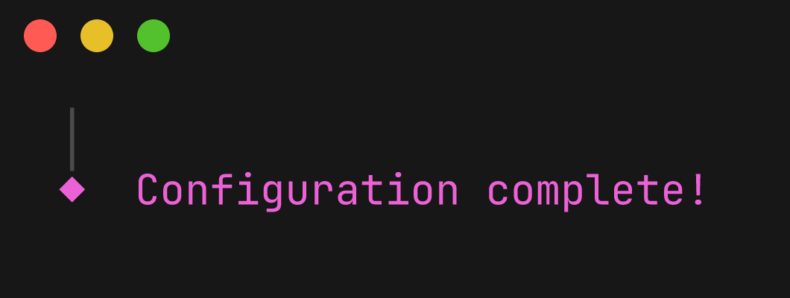

### log-warn

Warning messages for non-critical issues

```typescript
import { log } from "@poe-code/design-system";
log.warn("API key expires in 7 days");
```

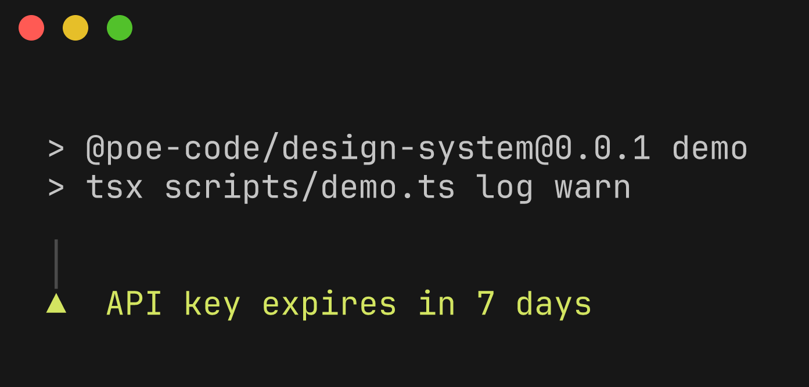

### log-error

Error messages for failures

```typescript
import { log } from "@poe-code/design-system";
log.error("Failed to write config file");
```

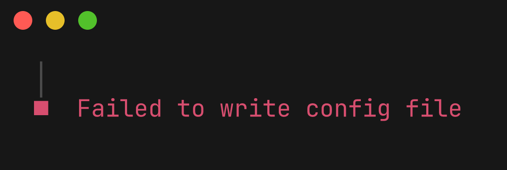

## Prompts

Interactive prompts for user input. Import from `@poe-code/design-system`.

### prompt-intro

Command intro banner with animation

```typescript
import { intro } from "@poe-code/design-system";
intro("Configure");
```


### prompt-note

Boxed note for next steps or important info

```typescript
import { note } from "@poe-code/design-system";
note("Run poe-code test", "Next steps.");
```


### prompt-outro

Command outro with feedback link

```typescript
import { outro } from "@poe-code/design-system";
outro("Problems? https://...");
```


### prompt-resolved

Resolved prompt value display

```typescript
import { log, symbols } from "@poe-code/design-system";
log.message("API Key\n   poe-abc...xyz", { symbol: symbols.resolved });
```

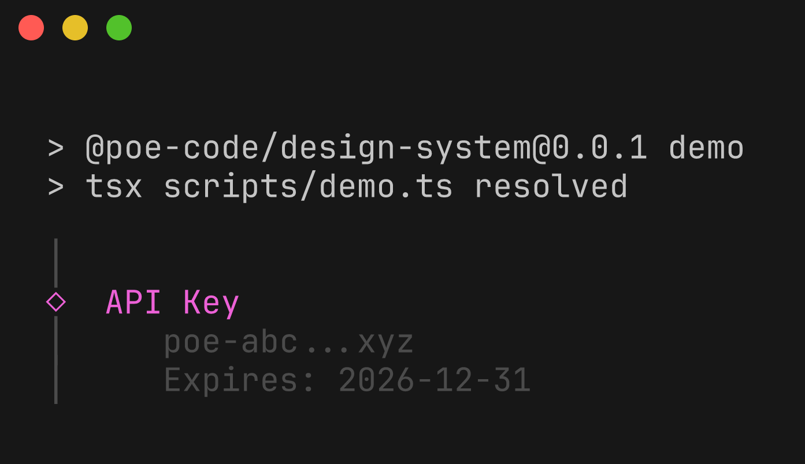

### prompt-errorResolved

Error with details display

```typescript
import { log, symbols } from "@poe-code/design-system";
log.message("Config Failed\n   Missing API key", { symbol: symbols.errorResolved });
```


### menu

Interactive select prompt for choosing options

```typescript
import { select } from "@poe-code/design-system";
const choice = await select({
  message: "Pick an agent:",
  options: [
    { value: "claude-code", label: "Claude Code" },
    { value: "codex", label: "Codex CLI" }
  ]
});
```

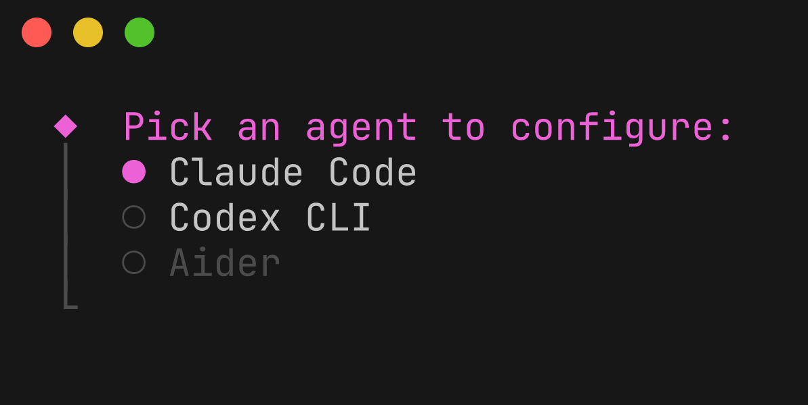

## Static Rendering

Utilities for rendering UI elements as static strings (for screenshots, tests, or non-interactive output).

### spinner-dots

Animated dots spinner for async operations

```typescript
import { spinner } from "@poe-code/design-system";
const s = spinner();
s.start("Configuring...");
await doWork();
s.stop("Done!");
```

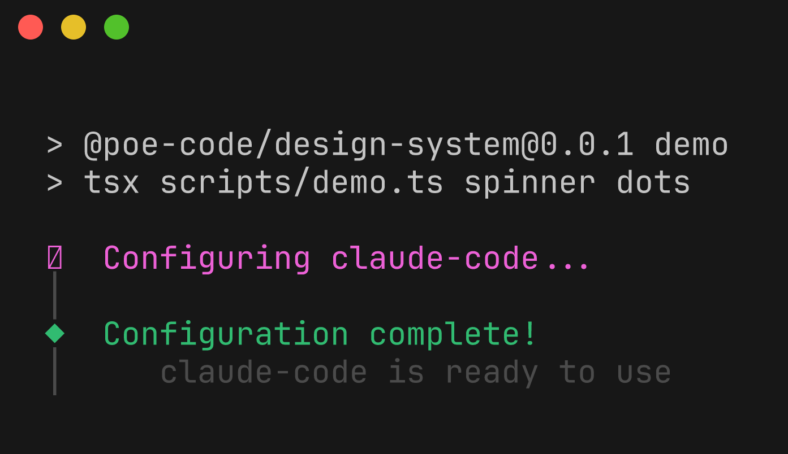

### spinner-timer

Timer spinner showing elapsed time

```typescript
import { renderSpinnerFrame, renderSpinnerStopped } from "@poe-code/design-system";
const frame = renderSpinnerFrame({ message: "Processing...", timer: "1s" });
const stopped = renderSpinnerStopped({ message: "Complete!", timer: "2s" });
```

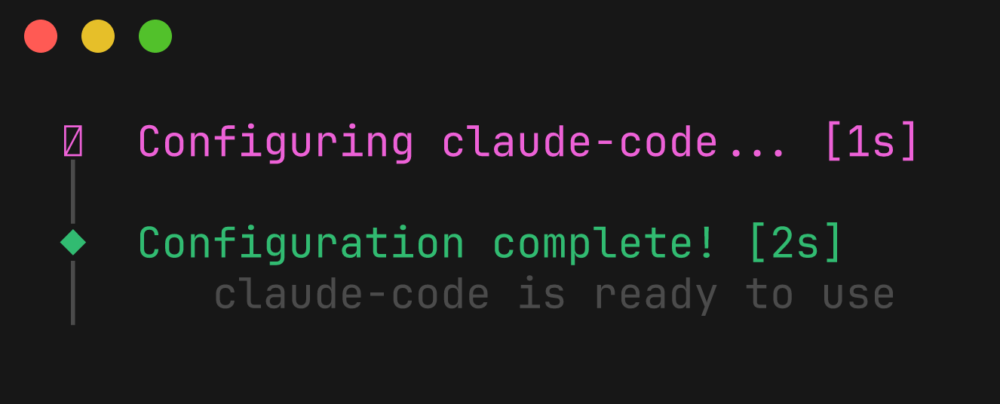

### table-markdown

Table rendered as markdown for piping, copying, or non-terminal output

```typescript
import { renderTable, getTheme, resetOutputFormatCache, resolveOutputFormat } from "@poe-code/design-system";

resetOutputFormatCache();
resolveOutputFormat({ OUTPUT_FORMAT: "markdown" });

const md = renderTable({
  theme: getTheme(),
  columns: [
    { name: "Model", title: "Model", alignment: "left", maxLen: 30 },
    { name: "Context", title: "Context", alignment: "right", maxLen: 9 },
  ],
  rows: [
    { Model: "anthropic/claude-sonnet-4", Context: "200K" },
  ],
});
```

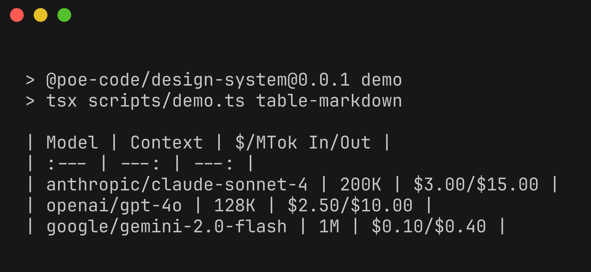

### diff

Unified diff display for file changes (used in --dry-run)

```typescript
import { log } from "@poe-code/design-system";
import chalk from "chalk";
const diffLines = [
  chalk.gray("--- config.json"),
  chalk.red('-  "model": "gpt-4",'),
  chalk.green('+  "model": "claude-sonnet-4",')
];
log.message(diffLines.join("\n"), { symbol: chalk.yellow("~") });
```

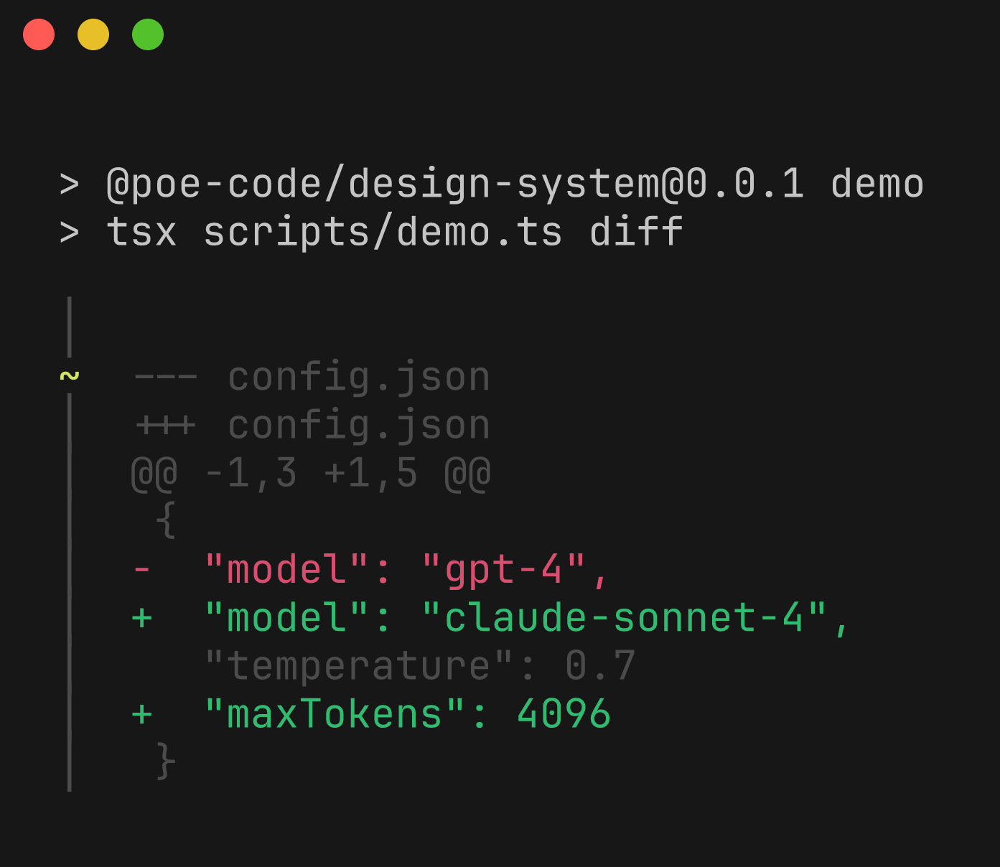
