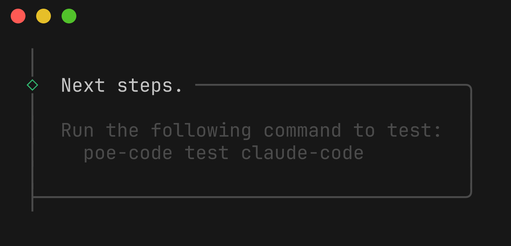
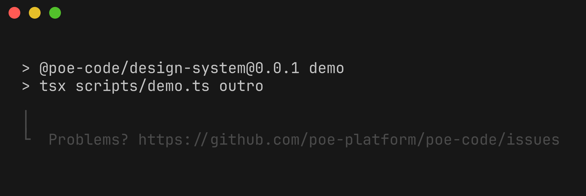
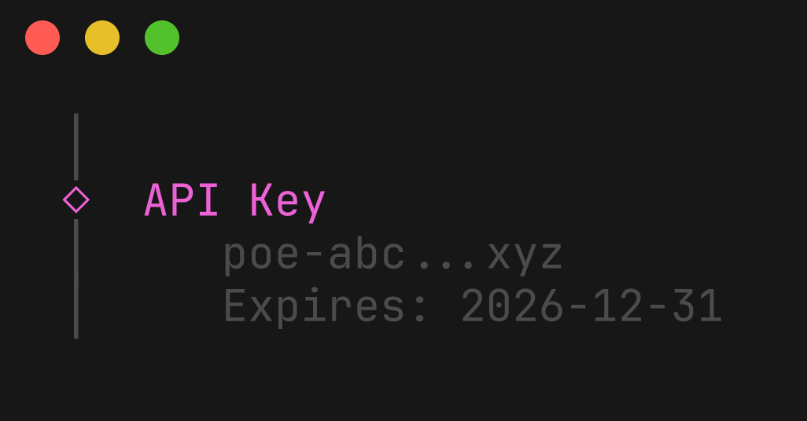
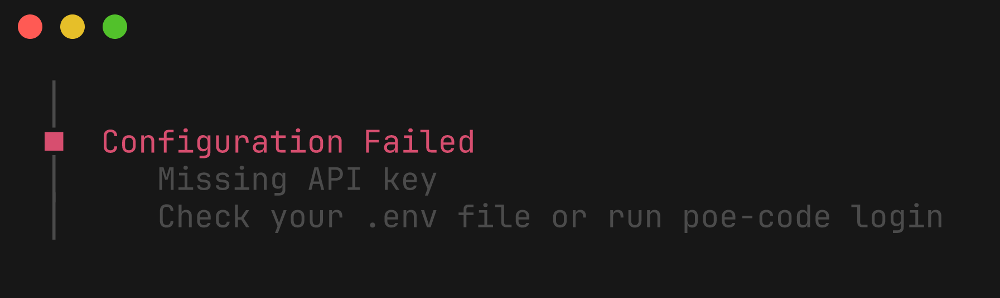

# Design Language

Visual reference for poe-code CLI design elements.

This document is auto-generated. Run `npm run generate:design-docs` to regenerate.

## Basic Layout

Standard command layout pattern. Note and outro are optional.

### layout-basic

Core layout: intro banner, info messages, resolved prompts, success message

```typescript
intro(design.text.intro("Configure"));
log.message("Configuring...", { symbol: design.symbols.info });
log.message("Provider\n   claude", { symbol: design.symbols.resolved });
log.message("API Key\n   poe-abc...xyz", { symbol: design.symbols.resolved });
log.message("Done!", { symbol: design.symbols.success });
```


### layout-expanded

Full layout with note and outro: intro, resolved prompts, success, note box, outro

```typescript
intro(design.text.intro("configure claude-code"));
log.message("Claude Code default model\n   Claude-Opus-4.5", { symbol: design.symbols.resolved });
log.message("Configured Claude Code.", { symbol: design.symbols.success });
note("If using VSCode...\nvscode://settings/...", "Next steps.");
outro(chalk.dim("Problems? https://..."));
```


## Text Styles

Core text styling functions for consistent CLI output.

### intro

Prominent introductory banners with brand background

```typescript
design.text.intro("Configure")
```


### heading

Section headings with brand accent color

```typescript
design.text.heading("Available Commands")
```


### section

Bold text for subsection labels

```typescript
design.text.section("Options:")
```


### command

CLI command names in accent color

```typescript
design.text.command("poe-code configure")
```


### argument

Command arguments (dimmed)

```typescript
design.text.argument("<provider>")
```


### option

CLI flags and options in yellow

```typescript
design.text.option("--dry-run")
```


### example

Example text (dimmed)

```typescript
design.text.example("$ poe-code configure claude")
```


### usageCommand

Commands in usage examples (green)

```typescript
design.text.usageCommand("npm install -g poe-code")
```


### link

Hyperlinks and references

```typescript
design.text.link("https://poe.com")
```


### muted

De-emphasized text

```typescript
design.text.muted("(optional)")
```


## Symbols

Status indicators and visual markers.

### info

Information indicator (magenta dot)

```typescript
logger.info("Configuring claude-code...")
```


### success

Success indicator (magenta diamond)

```typescript
logger.success("Configuration complete!")
```


### resolved

Resolved/completed indicator (hollow diamond)

```typescript
logger.resolved("API Key", "poe-abc...xyz")
```


### errorResolved

Error with details indicator (red square)

```typescript
logger.errorResolved("Config Failed", "Missing API key")
```


## Log Messages

Structured logging with appropriate visual weight.

### log-info

Informational messages during operations

```typescript
logger.info("Configuring claude-code...")
```


### log-success

Success confirmation messages

```typescript
logger.success("Configuration complete!")
```


### log-warn

Warning messages for non-critical issues

```typescript
logger.warn("API key expires in 7 days")
```


### log-error

Error messages for failures

```typescript
logger.error("Failed to write config file")
```


## Clack Containers

Structural UI elements from @clack/prompts.

### clack-intro

Command intro banner with animation

```typescript
intro(design.text.intro("Configure"))
```


### clack-note

Boxed note for next steps or important info

```typescript
note("Run poe-code test", "Next steps.")
```



### clack-outro

Command outro with feedback link

```typescript
outro(chalk.dim("Problems? https://..."))
```



### clack-resolved

Resolved prompt value display

```typescript
logger.resolved("API Key", "poe-abc...xyz")
```



### clack-errorResolved

Error with details display

```typescript
logger.errorResolved("Config Failed", "Missing API key")
```



### spinner-dots

Animated dots spinner for async operations

```typescript
const s = spinner({ indicator: "dots" });
s.start("Configuring...");
await doWork();
s.stop("Done!");
```


### spinner-timer

Timer spinner showing elapsed time

```typescript
const s = spinner({ indicator: "timer" });
s.start("Processing...");
await doWork();
s.stop("Complete!");
```


## Complex Patterns

Multi-line UI patterns for rich interactions.

### diff

Unified diff display for file changes (used in --dry-run)

```typescript
log.message(diffLines.join("\n"), { symbol: "~" })
```


### menu

Interactive select prompt for choosing options

```typescript
select({ message: "Pick an agent:", options: [...] })
```


